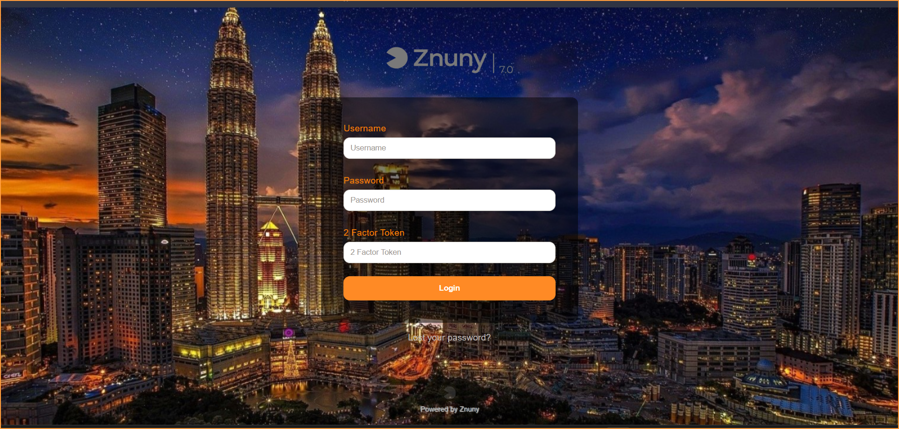

# Znuny-Agent-Login-Background
- Show agent login background (image)
- Based on Znuny 7.0.x
 
1. Upload your image at /opt/znuny/var/httpd/htdocs/skins/Agent/default/img/
2. Update **Admin > System Configuration > AgentLoginBackground**  
3. To change login form background color, MOTD background color and username and password label color, check **Admin > System Configuration > AgentLoginBackgroundColor**  
	
		AgentLabelColor = color of the label username and password
		AgentLoginFormBackground = color of the login form background
		AgentLoginFormBorder = color of the login form border.
		AgentMOTDBackground = color of the MOTD background.
		AgentMOTDBorder =  color of the MOTD border.
	
	

